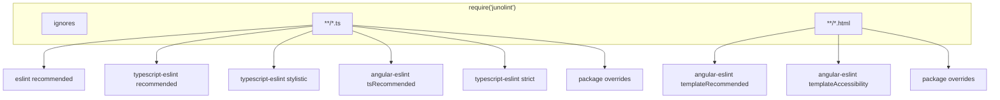
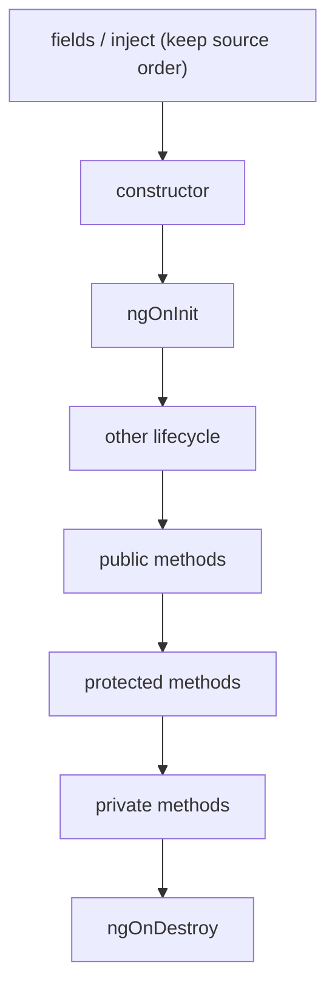

# Rules

What this package turns on after you `require('junolint')`, and how to change it. Install and examples: [README](README.md).

ESLint 9 flat config only. Spread the array, then override:

```js
module.exports = [
  ...require('junolint'),
  {
    files: ['**/*.ts'],
    rules: {
      '@typescript-eslint/no-explicit-any': 'warn',
      '@stylistic/max-len': ['error', { code: 120, ignoreComments: true }]
    }
  },
  {
    files: ['**/*.html'],
    rules: {
      'junolint/template-max-nesting': ['error', { max: 5 }],
      '@angular-eslint/template/prefer-ngsrc': 'off'
    }
  }
];
```

`'off'`, `'warn'`, `'error'`, or `[severity, options]`. The last matching block wins.



`configs.typescript` skips the Angular boxes. `config({ ignores, tsFiles, htmlFiles, angular })` changes globs or turns Angular off. See the [README](README.md#setup).

Default ignores: `**/.angular/**`, `**/android/**`, `**/generated/*`, `**/dist/**`, `**/migrations/**`, `release/**`.

## junolint

Examples: [README](README.md#custom-rules).

| Rule | Files | Default | `--fix` |
| --- | --- | --- | --- |
| `junolint/template-attribute-wrapping` | HTML | error | yes |
| `junolint/template-sibling-spacing` | HTML | error | yes |
| `junolint/template-max-nesting` | HTML | warn `{ max: 7 }` | no |
| `junolint/member-ordering` | TS | error | yes (not fields) |
| `junolint/grouped-class-fields` | TS | error | yes |
| `junolint/no-unicode-symbols` | TS, HTML | error | yes |
| `junolint/no-maybe-in-naming` | TS | error | no |
| `junolint/no-leading-the` | TS | error | no |
| `junolint/no-magic-numbers` | TS | error | no |
| `junolint/no-deprecated` | TS | error | no |
| `junolint/prefer-sentence-names` | TS | off `{ minLength: 0 }` | no |
| `junolint/prefer-sentence-function-names` | TS | off `{ minLength: 0 }` | no |
| `junolint/decompose-complex-expressions` | TS | off `{ threshold: 5 }` | no |
| `junolint/component-own-folder` | TS | error | yes (CLI `--fix`) |
| `junolint/component-max-external-types` | TS | warn `{ max: 2 }` | no |
| `junolint/explicit-function-return-type` | TS | error | yes (void / never / literals / `as`) |
| `junolint/sort-imports` | TS | error | yes |

`@typescript-eslint/member-ordering` is off. Use `junolint/member-ordering`.

`member-ordering` keeps fields in the order you wrote them (`inject()` / initializer order stays valid). Methods then go constructor, `ngOnInit` directly under it, other Angular lifecycle hooks, public → protected → private methods, and `ngOnDestroy` last. A member is left where it is when moving it would use another class field before that field is declared (including `ngOnInit` / `ngOnDestroy` written as fields).

`grouped-class-fields` packs consecutive single-line fields that share a top-level initializer call (`inject`, `signal`, `input` / `input.required`, `viewChild` / `viewChild.required`, …) and requires one blank line between different groups. If a field already spans more than one line, blank lines around it are left alone. It does not reorder fields. All classes, not only `@Component`.

```js
'junolint/template-max-nesting': ['warn', { max: 5 }],
'junolint/grouped-class-fields': 'warn',
'junolint/no-leading-the': 'warn',
'junolint/no-magic-numbers': ['error', { allowed: [404, 500] }],
'junolint/no-deprecated': ['error', { allow: ['legacyAdapter'] }],
'junolint/prefer-sentence-names': ['warn', { minLength: 0 }],
'junolint/prefer-sentence-function-names': ['warn', { minLength: 0 }],
'junolint/decompose-complex-expressions': ['warn', { threshold: 5 }],
'junolint/component-own-folder': 'warn',
'junolint/component-max-external-types': ['warn', { max: 2 }],
'junolint/explicit-function-return-type': ['error', { checkCallbacks: true, allowedNames: ['legacyAdapter'] }],
'junolint/sort-imports': 'warn'
```

`no-leading-the` flags names whose first camelCase / snake_case word is `the` (`theHttpClient`). Words that only contain those letters (`themeStudio`, `theoreticalLimit`) are allowed.

`no-magic-numbers` flags unexplained numeric literals. Common values stay (`-2` to `2`, and powers of ten such as `10`, `100`, `1000`). A number that initializes a named binding, class field, default, enum member, or object property is allowed. `allowed` adds extra literals (`404`). No `--fix`.

`no-deprecated` flags uses of names marked `@deprecated` in JSDoc. Defining a deprecated API is allowed; calling it, constructing it, extending it, or referring to its type is not. `this` / `super` / `new Class()` resolve members in the same file, including inherited ones. `allow` skips exact names. If type-aware linting is on (`parserOptions.projectService`), imported and library APIs are checked too. No `--fix`.

`prefer-sentence-names` is off. When enabled, a name must read as a sentence (two or more camelCase / snake_case words) so the value is obvious without extra context. `minLength` allows names shorter than that many characters (`id`, loop indexes). `exceptions` skips exact names.

`prefer-sentence-function-names` is the same check for functions and methods. Constructors are skipped. Class fields stay on `prefer-sentence-names`.

`decompose-complex-expressions` is off. When enabled, it flags expressions that combine several independent or nested computations where a named intermediate step would help. It does not flag fluent APIs, array pipelines, Promise chains, or RxJS `pipe` just because they contain many calls. Object literals are not flagged for having several properties. `threshold` (default `5`) is the minimum complexity score; raise it to complain less. No `--fix`.

`explicit-function-return-type` requires a return type on functions and methods. Constructors and setters are skipped. Callbacks passed into calls (`map`, `setTimeout`, `subscribe`) are skipped unless you set `checkCallbacks`. `--fix` inserts `: void`, `: Promise<void>`, `: never`, a primitive literal type, or an `as` type when every path is obvious. It does not invent types for `getUser()` or `number | undefined`.

`component-own-folder` allows one `@Component` as a direct child of any folder. If two or more differently named components share a folder, each extra one must move into a subfolder named from its TypeScript file, unless the name before the first `.` matches the parent folder (`login/` keeps `login.service.ts`, `login.component.ts`, and `login-page.component.ts`; `Logout.component.ts` moves). Typed siblings that are not a `component` or `page` are not counted as extra components. CLI `eslint --fix` creates that folder, moves the component files (including a spec), and rewrites relative imports. The editor lightbulb cannot move files.

`component-max-external-types` warns when a file with `@Component` declares more than two interfaces, type aliases, or enums outside the class. The first two in source order stay; each extra one is reported. Imports, re-exports, helper classes, and types nested in functions do not count. Spec and `.d.ts` files are skipped. `max` changes the allowance. No `--fix`.

`sort-imports` sorts import declarations alphabetically: packages first, then relative paths (`../` before `./`). Named specifiers inside `{ }` are sorted the same way. `import type` from the same module sits after the value import. Side-effect imports (`import './polyfills'`) stay where they are and are not reordered. `--fix`.



## Angular TypeScript

`*.ts` when Angular is enabled. `tsRecommended` plus the suffix / inline-template settings below.

| Rule | Default |
| --- | --- |
| `@angular-eslint/component-class-suffix` | error `{ suffixes: ['Component', 'Page', 'Stub'] }` |
| `@angular-eslint/component-max-inline-declarations` | error `{ template: 3, styles: 0 }` |
| `@angular-eslint/directive-class-suffix` | error |
| `@angular-eslint/contextual-lifecycle` | error |
| `@angular-eslint/no-empty-lifecycle-method` | error |
| `@angular-eslint/no-input-rename` | error |
| `@angular-eslint/no-inputs-metadata-property` | error |
| `@angular-eslint/no-output-native` | error |
| `@angular-eslint/no-output-on-prefix` | error |
| `@angular-eslint/no-output-rename` | error |
| `@angular-eslint/no-outputs-metadata-property` | error |
| `@angular-eslint/prefer-inject` | error |
| `@angular-eslint/prefer-standalone` | error |
| `@angular-eslint/use-lifecycle-interface` | warn |
| `@angular-eslint/use-pipe-transform-interface` | error |

```js
'@angular-eslint/component-class-suffix': ['error', { suffixes: ['Component', 'Page'] }],
'@angular-eslint/component-max-inline-declarations': ['error', { template: 5, styles: 0 }]
```

## Angular templates

`*.html`. `templateRecommended` + `templateAccessibility`, then the defaults below.


| Rule | Default |
| --- | --- |
| `@angular-eslint/template/attributes-order` | error, order above, not alphabetical |
| `@angular-eslint/template/banana-in-box` | error |
| `@angular-eslint/template/eqeqeq` | error |
| `@angular-eslint/template/prefer-control-flow` | error |
| `@angular-eslint/template/no-negated-async` | warn (preset is error) |
| `@angular-eslint/template/no-call-expression` | off |
| `@angular-eslint/template/button-has-type` | warn |
| `@angular-eslint/template/cyclomatic-complexity` | warn `{ maxComplexity: 10 }` |
| `@angular-eslint/template/prefer-ngsrc` | warn |
| `@angular-eslint/template/prefer-self-closing-tags` | warn |
| `@angular-eslint/template/use-track-by-function` | warn |
| `@angular-eslint/template/alt-text` | error |
| `@angular-eslint/template/click-events-have-key-events` | error |
| `@angular-eslint/template/elements-content` | error |
| `@angular-eslint/template/interactive-supports-focus` | error |
| `@angular-eslint/template/label-has-associated-control` | error |
| `@angular-eslint/template/mouse-events-have-key-events` | error |
| `@angular-eslint/template/no-autofocus` | error |
| `@angular-eslint/template/no-distracting-elements` | error |
| `@angular-eslint/template/role-has-required-aria` | error |
| `@angular-eslint/template/table-scope` | error |
| `@angular-eslint/template/valid-aria` | error |

```js
'@angular-eslint/template/attributes-order': ['error', {
  alphabetical: false,
  order: require('junolint').TEMPLATE_ATTRIBUTE_ORDER
}],
'@angular-eslint/template/cyclomatic-complexity': ['warn', { maxComplexity: 15 }],
'@angular-eslint/template/no-call-expression': 'error'
```

## TypeScript

typescript-eslint recommended + stylistic + strict, then these options. Docs: [typescript-eslint.io/rules](https://typescript-eslint.io/rules/).

| Rule | Default |
| --- | --- |
| `@typescript-eslint/adjacent-overload-signatures` | error |
| `@typescript-eslint/array-type` | error `{ default: 'array' }` |
| `@typescript-eslint/ban-ts-comment` | error `{ minimumDescriptionLength: 10 }` |
| `@typescript-eslint/ban-tslint-comment` | error |
| `@typescript-eslint/class-literal-property-style` | error |
| `@typescript-eslint/consistent-generic-constructors` | error |
| `@typescript-eslint/consistent-indexed-object-style` | error |
| `@typescript-eslint/consistent-type-assertions` | error |
| `@typescript-eslint/consistent-type-definitions` | error |
| `@typescript-eslint/explicit-member-accessibility` | error `{ accessibility: 'no-public' }` |
| `@typescript-eslint/explicit-module-boundary-types` | off |
| `@typescript-eslint/member-ordering` | off (use `junolint/member-ordering`) |
| `@typescript-eslint/no-array-constructor` | error |
| `@typescript-eslint/no-confusing-non-null-assertion` | error |
| `@typescript-eslint/no-duplicate-enum-values` | error |
| `@typescript-eslint/no-dynamic-delete` | error |
| `@typescript-eslint/dot-notation` | off |
| `@typescript-eslint/no-empty-function` | off |
| `@typescript-eslint/no-empty-object-type` | error |
| `@typescript-eslint/no-explicit-any` | error |
| `@typescript-eslint/no-extra-non-null-assertion` | error |
| `@typescript-eslint/no-extraneous-class` | off |
| `@typescript-eslint/no-inferrable-types` | error |
| `@typescript-eslint/no-invalid-this` | error |
| `@typescript-eslint/no-invalid-void-type` | error |
| `@typescript-eslint/no-misused-new` | error |
| `@typescript-eslint/no-namespace` | error |
| `@typescript-eslint/no-non-null-asserted-nullish-coalescing` | error |
| `@typescript-eslint/no-non-null-asserted-optional-chain` | error |
| `@typescript-eslint/no-non-null-assertion` | error |
| `@typescript-eslint/no-require-imports` | error |
| `@typescript-eslint/no-this-alias` | error |
| `@typescript-eslint/no-unnecessary-type-constraint` | error |
| `@typescript-eslint/no-unsafe-declaration-merging` | error |
| `@typescript-eslint/no-unsafe-function-type` | error |
| `@typescript-eslint/no-unused-expressions` | error |
| `@typescript-eslint/no-unused-vars` | error `{ argsIgnorePattern: '^_', ignoreRestSiblings: true }` |
| `@typescript-eslint/no-useless-constructor` | error |
| `@typescript-eslint/no-wrapper-object-types` | error |
| `@typescript-eslint/prefer-as-const` | error |
| `@typescript-eslint/prefer-for-of` | error |
| `@typescript-eslint/prefer-function-type` | error |
| `@typescript-eslint/prefer-literal-enum-member` | error |
| `@typescript-eslint/prefer-namespace-keyword` | error |
| `@typescript-eslint/triple-slash-reference` | error |
| `@typescript-eslint/unified-signatures` | error |

```js
'@typescript-eslint/no-explicit-any': 'warn',
'@typescript-eslint/no-unused-vars': ['error', { argsIgnorePattern: '^_', varsIgnorePattern: '^_' }],
'@typescript-eslint/array-type': ['error', { default: 'generic' }]
```

## Style

All error unless noted. Formatting lives on the unified `@stylistic` plugin. `@stylistic/js/…` and `@stylistic/ts/…` still resolve if you already override those names.

| Rule | Default |
| --- | --- |
| `@stylistic/indent` | 2 spaces, `SwitchCase: 1` (skips decorated params and some type params) |
| `@stylistic/quotes` | single, `avoidEscape` |
| `@stylistic/semi` | always |
| `@stylistic/comma-dangle` | never |
| `@stylistic/comma-spacing` | error |
| `@stylistic/member-delimiter-style` | multiline `;` with last; singleline `;` without last |
| `@stylistic/type-annotation-spacing` | error |
| `@stylistic/space-before-blocks` | error |
| `@stylistic/space-infix-ops` | error |
| `@stylistic/array-bracket-spacing` | error |
| `@stylistic/array-element-newline` | multiline, min 3 |
| `@stylistic/array-bracket-newline` | multiline, min 3 |
| `@stylistic/block-spacing` | always |
| `@stylistic/comma-style` | error |
| `@stylistic/no-multi-spaces` | error |
| `@stylistic/no-multiple-empty-lines` | max 1, maxEOF 1 |
| `@stylistic/space-before-function-paren` | never, `asyncArrow: always` |
| `@stylistic/space-in-parens` | error |
| `@stylistic/space-unary-ops` | error |
| `@stylistic/spaced-comment` | always, markers `/` |
| `import-newlines/enforce` | error, wrap after 2 specifiers |
| `junolint/sort-imports` | error, packages then relative, named specifiers A–Z |
| `@stylistic/eol-last` | error |
| `@stylistic/max-len` | error `{ code: 150, ignoreComments: true }` |
| `@stylistic/max-statements-per-line` | error `{ max: 1 }` |
| `@stylistic/new-parens` | error |
| `@stylistic/newline-per-chained-call` | error |
| `@stylistic/no-trailing-spaces` | error |
| `@stylistic/nonblock-statement-body-position` | error `below` |
| `one-var` | error `never` |
| `@stylistic/padding-line-between-statements` | error (see below) |

Blank line before/after `if` and other block-like statements, after functions, classes, and multiline expressions, and after a `const`/`let`/`var` when the next line is a different kind of statement. No blank line between two `const`s (same for `let` / `var`).

```js
'@stylistic/quotes': ['error', 'double', { avoidEscape: true }],
'@stylistic/max-len': ['error', { code: 120, ignoreComments: true }],
'import-newlines/enforce': ['error', 4]
```

## Core ESLint

eslint recommended, plus the ones with options. typescript-eslint turns some core rules off and owns the TypeScript version instead.

| Rule | Default |
| --- | --- |
| `complexity` | warn `{ max: 20 }` |
| `id-denylist` | warn: `e`, `cb`, `i`, `c`, `any`, `string`, `String`, `Undefined`, `undefined`, `callback` |
| `id-length` | error `{ min: 2, properties: 'never', exceptions: ['_', 'x', 'y'] }` |
| `no-cond-assign` | error |
| `no-eval` | error |
| `no-new-wrappers` | error |
| `no-restricted-imports` | error `rxjs/Rx` |
| `no-throw-literal` | error |
| `no-undef-init` | error |
| `no-unsafe-finally` | error |
| `no-var` | error |
| `prefer-const` | error |
| `prefer-rest-params` | error |
| `prefer-spread` | error |

Also error from eslint recommended: `for-direction`, `no-async-promise-executor`, `no-case-declarations`, `no-compare-neg-zero`, `no-constant-binary-expression`, `no-constant-condition`, `no-control-regex`, `no-debugger`, `no-delete-var`, `no-dupe-else-if`, `no-duplicate-case`, `no-empty-character-class`, `no-empty-pattern`, `no-empty-static-block`, `no-ex-assign`, `no-extra-boolean-cast`, `no-fallthrough`, `no-global-assign`, `no-invalid-regexp`, `no-irregular-whitespace`, `no-loss-of-precision`, `no-misleading-character-class`, `no-nonoctal-decimal-escape`, `no-octal`, `no-prototype-builtins`, `no-regex-spaces`, `no-self-assign`, `no-shadow-restricted-names`, `no-sparse-arrays`, `no-unexpected-multiline`, `no-unsafe-optional-chaining`, `no-unused-labels`, `no-unused-private-class-members`, `no-useless-backreference`, `no-useless-catch`, `no-useless-escape`, `require-yield`, `use-isnan`, `valid-typeof`.

```js
complexity: ['warn', { max: 15 }],
'id-denylist': 'off',
'id-length': ['error', { min: 3, properties: 'never', exceptions: ['_'] }],
'no-restricted-imports': ['error', 'rxjs/Rx', 'lodash']
```

## Off

| Rule | Notes |
| --- | --- |
| `curly` | braces not required |
| `no-bitwise` | bitwise ops allowed |
| `no-empty` | empty blocks allowed |
| `@typescript-eslint/dot-notation` | `obj['x']` allowed |
| `@typescript-eslint/explicit-module-boundary-types` | use `junolint/explicit-function-return-type` |
| `@typescript-eslint/member-ordering` | use `junolint/member-ordering` |
| `@typescript-eslint/no-empty-function` | empty methods allowed |
| `@typescript-eslint/no-extraneous-class` | decorator-only classes (Angular) |
| `@angular-eslint/template/no-call-expression` | method calls in templates allowed |

These core rules are off because typescript-eslint replaces them. Leave them off on `*.ts`:

`constructor-super`, `getter-return`, `no-array-constructor`, `no-class-assign`, `no-const-assign`, `no-dupe-args`, `no-dupe-class-members`, `no-dupe-keys`, `no-empty-function`, `no-func-assign`, `no-import-assign`, `no-new-native-nonconstructor`, `no-new-symbol`, `no-obj-calls`, `no-redeclare`, `no-setter-return`, `no-this-before-super`, `no-undef`, `no-unreachable`, `no-unsafe-negation`, `no-unused-expressions`, `no-unused-vars`, `no-useless-constructor`, `no-with`.
